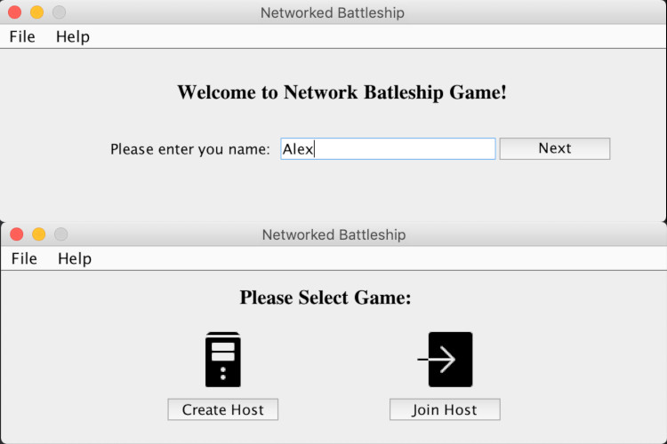
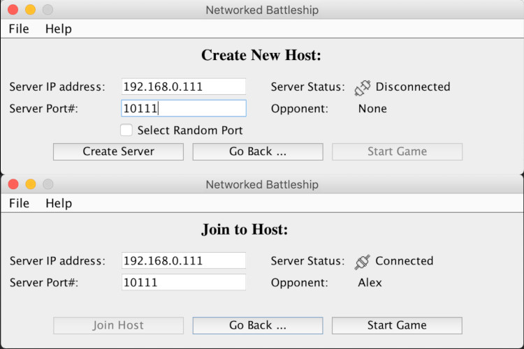
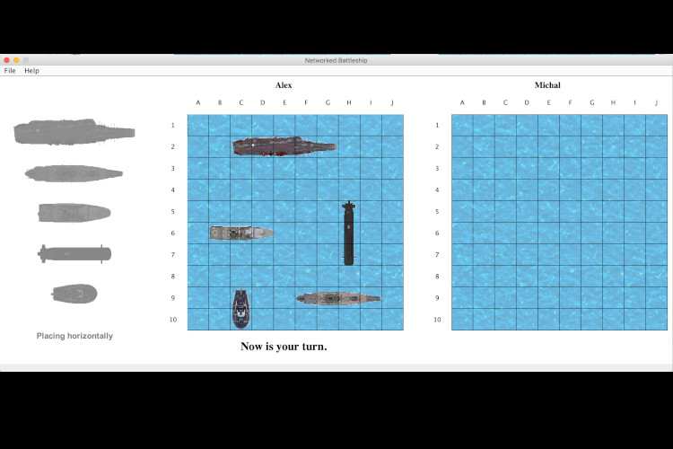
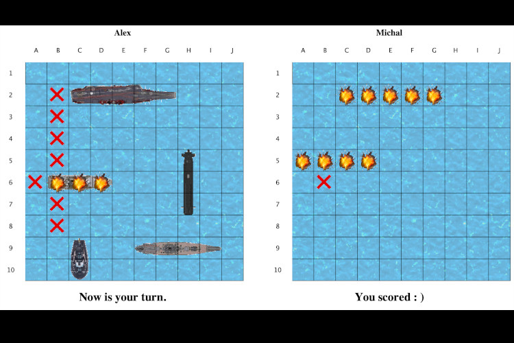
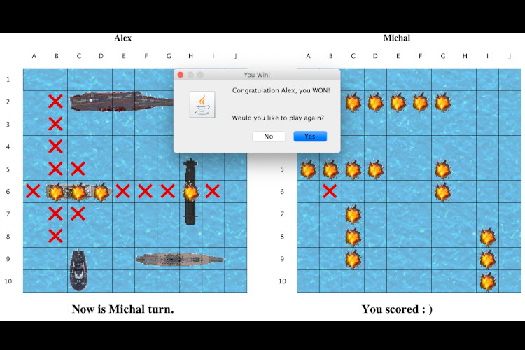

# networked-battleship
Networked Battleship Game.

This was a group project, and [Michal Bocknak](https://github.com/michalbochnak) was equaly involved in development of this game.

Battleship (also Battleships or Sea Battle) is a guessing game for two players. It is played on ruled grids (over the network) on which each players fleet of ships (including battleships) are marked. The locations of the fleets are concealed from the other player. Players alternate turns calling 'shots' at the other player's ships, and the objective of the game is to destroy the opposing player's fleet.

First, one player creates host and another player join the host over the network:

Before play begins, each player arranges a number of ships secretly on the grid for that player. Each ship occupies a number of consecutive squares on the grid, arranged either horizontally or vertically. The number of squares for each ship is determined by the type of the ship. 

| Type of Ship | Size  |
|--------------|:-----:|
| Aircraft Carrier | 5 |
| Battleship   |   4   |
| Destroyer    |   3   |
| Submarine    |   3   |
| Patrol Boat  |   2   

After the ships have been positioned, the game proceeds in a series of rounds. In each round, each player has a turn. During a turn, the player selects a target square in the opponents' grid which is to be shot at. If a ship occupies the squares, then it takes a hit. When all of the squares of a ship have been hit, the ship is sunk:

If at the end of a round all of one player's ships have been sunk, the game ends and the other player wins:

